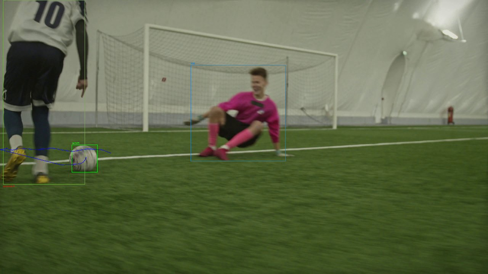
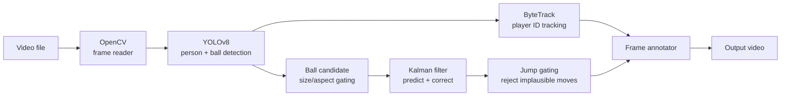

# football-ball-tracker ⚽


A computer-vision pipeline that detects and tracks the ball and players in
football footage using YOLOv8 and ByteTrack, drawing bounding boxes, player
IDs, and the ball's trajectory back onto the video.


<sub>Frame from `src/track_match.py`: player boxes with tracked IDs, the ball
box with detection confidence, and its trajectory trail.</sub>

> **Note:** This is a personal learning/testing project, not a maintained
> product. It was built to experiment with detection, tracking, and video
> pipelines — please don't expect frequent updates or support.

## What it does

Given a football video, the pipeline:

1. reads it frame by frame with OpenCV,
2. detects the ball and players in each frame with a pretrained YOLOv8 model,
3. assigns each player a persistent ID across frames with ByteTrack,
4. fills in gaps between ball detections with a Kalman filter so the ball's
   path stays continuous even when YOLO misses a few frames,
5. rejects implausible ball detections (wrong size, wrong shape, impossible
   jumps) that would otherwise show up as false positives,
6. writes an annotated output video with player boxes/IDs, the ball box, and
   its trajectory trail.

## Key capabilities

| Capability | Outcome |
|---|---|
| Ball detection (YOLOv8, COCO "sports ball" class) | Per-frame ball bounding box and confidence, no training required |
| Kalman-filter ball tracking | Bridges missed detections so the trajectory doesn't break every time YOLO loses the ball |
| False-positive gating | Filters out detections that are the wrong size/shape or jump implausibly far between frames |
| Player detection + ByteTrack IDs | Each visible player gets a tracked ID (`#N`) drawn in a consistent color |
| Nearest-player-to-ball proxy | Flags the player closest to the ball as a rough, unvalidated possession indicator |

## Quick start

```bash
git clone https://github.com/Pouya-Mansournia/football-ball-tracker.git
cd football-ball-tracker
pip install -r requirements.txt

# Ball tracking only
python src/track_ball.py --video videos/<your_video>.mp4 --output output/tracked.mp4

# Ball + player detection/tracking
python src/track_match.py --video videos/<your_video>.mp4 --output output/match_tracked.mp4
```

YOLOv8 weights (`yolov8n.pt`, `yolov8s.pt`) download automatically via
`ultralytics` on first run. A sample clip is included at
`videos/football_match_02.mp4`; drop your own footage in `videos/` to try it
on something else.

## CLI reference

`src/track_ball.py` (ball only):

| Flag | Default | Purpose |
|---|---|---|
| `--video` | `videos/football_match_01.mp4` | Input video path |
| `--output` | `output/ball_tracked.mp4` | Output video path |
| `--model` | `yolov8n.pt` | Ultralytics YOLO weights |
| `--conf` | `0.15` | Confidence threshold for the ball class |
| `--max-box-area-ratio` | `0.03` | Reject ball boxes larger than this fraction of the frame area — raise for close-up footage, lower for wide broadcast shots |
| `--max-aspect-ratio` | `1.6` | Reject ball boxes more elongated than this width/height ratio |
| `--show` | off | Live preview window while processing |

`src/track_match.py` (ball + players) shares `--max-box-area-ratio`,
`--max-aspect-ratio`, and `--show` with `track_ball.py`, but defaults to
`--video videos/football_match_02.mp4`, `--output output/match_tracked.mp4`,
and `--model yolov8s.pt`, and adds:

| Flag | Default | Purpose |
|---|---|---|
| `--ball-conf` | `0.15` | Confidence threshold for the ball class |
| `--player-conf` | `0.3` | Confidence threshold for the person class |
| `--tracker` | `configs/bytetrack_stable.yaml` | ByteTrack config for player ID tracking |

## Architecture



- **Detection** (`YOLO(...).track(...)`) runs once per frame for both the
  `person` and `sports ball` COCO classes.
- **Ball path**: candidate boxes are filtered by size/aspect ratio, then fed
  through a constant-velocity Kalman filter. A prediction is only trusted for
  up to 15 consecutive missed frames and only if it stays inside the frame —
  otherwise tracking resets rather than drawing a runaway prediction.
- **Player path**: ByteTrack assigns and persists IDs; `configs/bytetrack_stable.yaml`
  raises the track buffer and IoU match threshold from Ultralytics' defaults
  to reduce ID switching on motion-blurred handheld footage.

## Repository structure

```text
football-ball-tracker/
├── src/
│   ├── detect_ball.py     # V1: ball detection only, no tracking
│   ├── track_ball.py      # V1.5: ball detection + Kalman tracking
│   └── track_match.py     # V2: + player detection/tracking
├── configs/
│   └── bytetrack_stable.yaml  # tuned ByteTrack params
├── docs/
│   └── preview.jpg
├── videos/                # input clips
├── output/                # annotated output videos (not tracked in git)
└── requirements.txt
```

## Known limitations

- **Ball detection uses a generic pretrained model.** YOLOv8 was never
  fine-tuned on football footage, so recall varies a lot with camera
  distance, motion blur, and occlusion — the `--max-box-area-ratio` and
  `--conf` flags need re-tuning per video.
- **ByteTrack has no appearance re-identification.** It matches boxes by IoU
  only, so a player who leaves the frame (or is fully occluded) and comes
  back gets a new ID instead of resuming their old one.
- **"Possession" is a nearest-player heuristic**, not a validated
  possession-detection algorithm.
- Tested only on short (10–45 second) clips; no evaluation on full matches.

## Roadmap

- [x] Ball detection (V1)
- [x] Kalman-filter ball tracking + false-positive gating (V1.5)
- [x] Player detection & ID tracking (V2)
- [ ] Pitch homography (broadcast view → top-down pitch coordinates)
- [ ] Validated possession estimation
- [ ] Pass detection
- [ ] Ball/player heatmaps

## License

[MIT](LICENSE)
